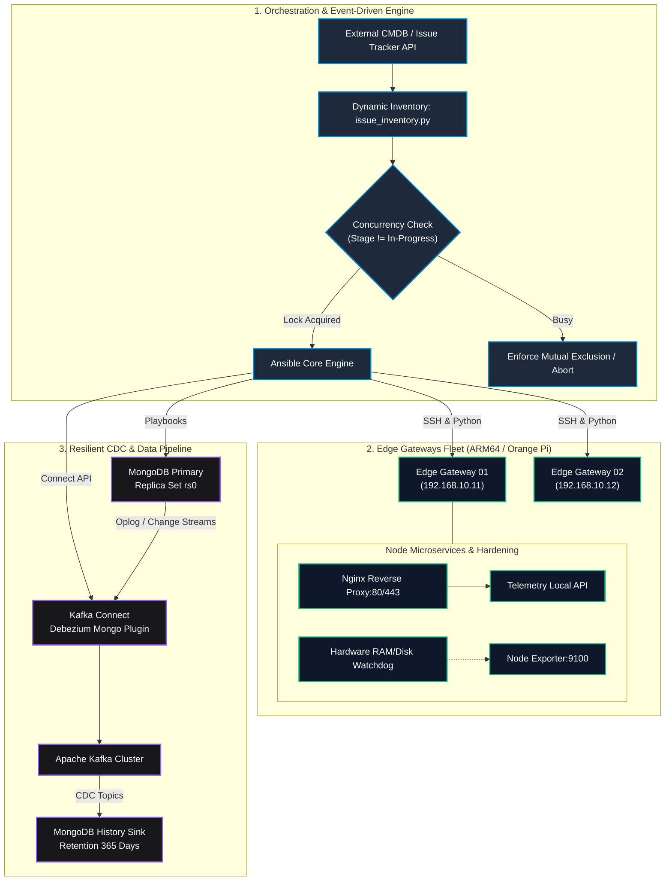

# 🚀 Edge Infrastructure Orchestrator

[](https://www.ansible.com/)
[](https://www.docker.com/)
[](https://kafka.apache.org/)
[](https://www.mongodb.com/)
[](https://www.python.org/)
[](https://opensource.org/licenses/MIT)

An enterprise-ready **Infrastructure as Code (IaC)**, **Event-Driven Orchestration**, and **Resilient Data Streaming (CDC)** framework designed for distributed Edge computing nodes (Orange Pi / NanoPi / Linux Gateways) and high-availability database clusters.

---

## 📌 Executive Summary

Maintaining fleets of remote IoT gateways and continuous data synchronization poses severe engineering challenges: network instability, limited flash memory and RAM, uncoordinated concurrent deployments, and accidental data losses.

This repository demonstrates a battle-tested infrastructure architecture that provides:
1. **Automated Provisioning & Self-Healing:** Event-driven playbooks managing gateway configurations, reverse proxies (ARM64), and proactive memory/disk health watchdogs.
2. **Dual-State Dynamic Inventory:** An intelligent Python inventory plugin that decouples live node status (`actual_*`) from requested actions (`target_*`), enforcing mutual exclusion (mutex) locks to eliminate deployment race conditions.
3. **Resilient Data Pipeline (CDC):** Real-time event streaming via **Apache Kafka** and **Debezium**, continuously replicating telemetry from operational databases to a permanent historical audit sink (preserving inserts and updates while dropping deletions).
4. **Production Hardening:** Docker Compose stacks configured with JSON log rotation, strictly bounded CPU/RAM resource limits, and read-only host timezone synchronization.

---

## 🏗️ System Architecture



---

## 📂 Repository Structure

```text
edge-infrastructure-orchestrator/
├── .github/
│   └── workflows/
│       ├── lint.yml                # Quality gate: ansible-lint, yaml-lint, flake8
│       └── validate-docker.yml     # Validation of Docker Compose stacks
│
├── ansible/
│   ├── ansible.cfg                 # Performance tuning (pipelining, profile_tasks)
│   ├── inventory/
│   │   ├── dynamic/
│   │   │   └── issue_inventory.py  # Dual-State dynamic inventory with mutex lock
│   │   └── hosts.example.yml       # Production-like topology inventory
│   ├── playbooks/
│   │   ├── site.yml                # Master orchestrator playbook
│   │   ├── setup_edge_nodes.yml    # Provisioning & hardening of gateways
│   │   ├── setup_mongo_cdc.yml     # Cluster deployment & Kafka CDC connectors
│   │   └── remediate_services.yml  # Automated remediation & self-healing
│   └── roles/
│       ├── common_hardening/       # Timezones, Docker log-rotation, sys limits
│       ├── edge_gateway/           # Nginx reverse proxy (multi-arch ARM64/x86_64)
│       ├── telemetry_monitor/      # Prometheus node_exporter & RAM watchdog
│       ├── mongo_replica/          # Replica sets, credentials, and TTL index policies
│       └── kafka_cdc/              # Debezium Source & MongoDB History Sink
│
├── docker/
│   ├── compose/
│   │   ├── docker-compose.prod.yml # Hardened production stack with quotas
│   │   └── docker-compose.cdc.yml  # Distributed streaming: Kafka, Zookeeper, Debezium
│   └── env.example                 # Sanitized configuration template
│
├── docs/
│   ├── architecture.md             # Complete architectural specifications
│   └── quickstart.md               # Step-by-step local testing instructions
│
├── scripts/
│   └── verify_cluster.sh           # Automated healthcheck and diagnostic utility
│
├── .gitignore
├── LICENSE
└── README.md
```

---

## ⚡ Key Highlights & Engineering Decisions

### 1. Dual-State Dynamic Inventory & Mutex Locking
* Avoids dangerous blind overrides by querying the target platform API and splitting parameters into `actual_*` (observed running state) and `target_*` (desired state from ticket/event).
* Implements a **Mutual Exclusion (Mutex)** lock: if any ticket is in `In-Progress`, new automation runs return an empty set, guaranteeing zero concurrent collisions.

### 2. Zero-Data-Loss Historical CDC Pipeline
* Employs **Debezium** to ingest Change Streams directly from MongoDB replica set oplogs.
* Transmits change events across Kafka topics to a dedicated **historical replica set** (`database_historic`).
* Configured specifically to **persist inserts and updates** while dropping destructive deletions, providing full audit compliance without polluting the high-speed operational node.

### 3. Production Docker Hardening
* **Storage Protection:** Enforces JSON log rotation (`max-size: 50m`, `max-file: 5`) to prevent disk exhaustion on Edge devices.
* **OOM Prevention:** Explicit `deploy.resources.limits` bounds CPU and RAM usage on every container.
* **Deterministic Time:** Maps `/etc/localtime:ro` and injects `TZ` parameters across all microservices.

---

## 🛠️ Quickstart

### Prerequisites
* Linux / WSL 2 (Ubuntu recommended)
* Docker & Docker Compose v2
* Python 3.10+ & Ansible 2.15+

### Run Automated Healthcheck & Lint Validation
```bash
# 1. Clone repository
git clone https://github.com/sgloayza/edge-infrastructure-orchestrator.git
cd edge-infrastructure-orchestrator

# 2. Run diagnostic script
./scripts/verify_cluster.sh

# 3. Test Ansible playbooks syntax
cd ansible
ansible-playbook playbooks/site.yml --syntax-check -i inventory/hosts.example.yml

# 4. Test Dynamic Inventory execution
python3 inventory/dynamic/issue_inventory.py --list
```

For full setup instructions, see the **[Quickstart Guide](docs/quickstart.md)** and **[Architecture Specifications](docs/architecture.md)**.

---

## 👤 Author & Contact

**Sandra Loayza**  
*Computer Science Engineer (ESPOL)*  
*DevOps, Backend & IoT Architecture Specialist*

* 🌐 **Portfolio:** [https://sgloayza.github.io/portfolio-web/](https://sgloayza.github.io/portfolio-web/)
* 🐙 **GitHub:** [@sgloayza](https://github.com/sgloayza)
* 💼 **LinkedIn:** [Sandra Loayza](https://linkedin.com/in/sgloayza)
* 📧 **Email:** [sgloayza94@gmail.com](mailto:sgloayza94@gmail.com)
