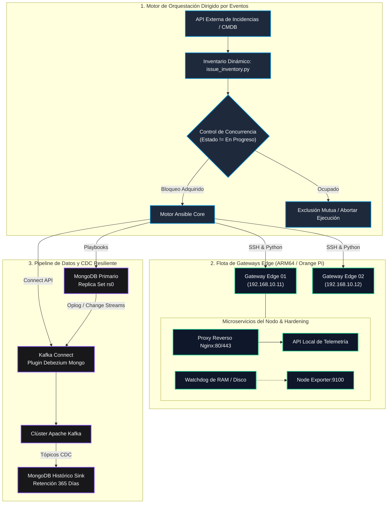

# 🚀 Edge Infrastructure Orchestrator

🌐 **Idioma / Language:** **Español 🇪🇸** | [Switch to English 🇺🇸](README.en.md)

[](https://www.ansible.com/)
[](https://www.docker.com/)
[](https://kafka.apache.org/)
[](https://www.mongodb.com/)
[](https://www.python.org/)
[](https://opensource.org/licenses/MIT)

Un framework empresarial de **Infraestructura como Código (IaC)**, **Orquestación Dirigida por Eventos (EDA)** y **Streaming de Datos Resiliente (CDC)** diseñado para flotas de nodos de computación Edge distribuidos (Orange Pi / NanoPi / Gateways Linux) y clústeres de bases de datos de alta disponibilidad.

---

## 📌 Resumen Ejecutivo

La administración y sincronización continua de flotas de gateways IoT remotos presenta retos de ingeniería críticos: inestabilidad de red, almacenamiento flash y memoria RAM limitados, despliegues concurrentes no coordinados y riesgos de pérdida accidental de datos.

Este repositorio demuestra una arquitectura de infraestructura probada en entornos de producción que proporciona:
1. **Aprovisionamiento Automatizado y Autorrecuperación:** Playbooks modulares dirigidos por eventos que gestionan configuraciones de red, proxies reversos (ARM64) y watchdogs proactivos para mitigar fugas de memoria RAM y saturación de disco.
2. **Inventario Dinámico de Doble Estado:** Plugin inteligente en Python que desacopla el estado real del nodo en campo (`actual_*`) del estado deseado reportado por la incidencia (`target_*`), implementando un bloqueo por exclusión mutua (Mutex) para evitar colisiones de ejecución simultánea.
3. **Pipeline de Datos Resiliente (CDC):** Streaming de eventos en tiempo real mediante **Apache Kafka** y **Debezium**, replicando continuamente la telemetría operativa hacia un nodo histórico inmutable (conservando inserciones y ediciones, y descartando eliminaciones destructivas para fines de auditoría).
4. **Hardening de Contenedores en Producción:** Manifiestos de Docker Compose con rotación estricta de logs en JSON, cuotas de recursos acotadas para CPU/RAM y sincronización horaria del host en modo solo lectura (`/etc/localtime:ro`).

---

## 🏗️ Arquitectura del Sistema



---

## 📂 Estructura del Repositorio

```text
edge-infrastructure-orchestrator/
├── .github/
│   └── workflows/
│       ├── lint.yml                # Control de calidad: ansible-lint, yaml-lint, flake8
│       └── validate-docker.yml     # Validación de sintaxis de Docker Compose
│
├── ansible/
│   ├── ansible.cfg                 # Ajustes de rendimiento (pipelining, profile_tasks)
│   ├── inventory/
│   │   ├── dynamic/
│   │   │   └── issue_inventory.py  # Inventario dinámico con patrón de doble estado y Mutex
│   │   └── hosts.example.yml       # Topología de producción de ejemplo
│   ├── playbooks/
│   │   ├── site.yml                # Playbook maestro de orquestación
│   │   ├── setup_edge_nodes.yml    # Aprovisionamiento y hardening de gateways
│   │   ├── setup_mongo_cdc.yml     # Despliegue de clúster y conectores Kafka CDC
│   │   └── remediate_services.yml  # Remediación automática y autorrecuperación
│   └── roles/
│       ├── common_hardening/       # Zona horaria, rotación de logs de Docker, límites del SO
│       ├── edge_gateway/           # Proxy Nginx multi-arquitectura (ARM64 / x86_64)
│       ├── telemetry_monitor/      # Prometheus node_exporter y watchdog de RAM
│       ├── mongo_replica/          # Replica sets, credenciales y políticas de retención TTL
│       └── kafka_cdc/              # Conectores Debezium Source y MongoDB History Sink
│
├── docker/
│   ├── compose/
│   │   ├── docker-compose.prod.yml # Stack de producción con cuotas estrictas
│   │   └── docker-compose.cdc.yml  # Streaming distribuido: Kafka, Zookeeper, Debezium
│   └── env.example                 # Plantilla de variables de entorno sanitizada
│
├── docs/
│   ├── architecture.md             # Especificaciones técnicas completas de arquitectura
│   └── quickstart.md               # Guía paso a paso de ejecución y pruebas locales
│
├── scripts/
│   └── verify_cluster.sh           # Utilidad de diagnóstico y comprobación de salud
│
├── .gitignore
├── LICENSE
├── README.en.md
├── README.md
└── requirements.txt
```

---

## ⚡ Aspectos Clave y Decisiones de Ingeniería

### 1. Inventario Dinámico de Doble Estado y Bloqueo Mutex
* Previene sobreescrituras destructivas consultando la API de gestión y dividiendo las variables en `actual_*` (estado real observado en el nodo) y `target_*` (estado deseado en la incidencia o evento).
* Implementa un cerrojo de **Exclusión Mutua (Mutex)**: si existe una tarea marcada como `En Progreso`, cualquier nueva ejecución retorna un inventario vacío, asegurando cero colisiones concurrentes.

### 2. Pipeline CDC Histórico con Cero Pérdida de Datos
* Utiliza **Debezium** para capturar los flujos de cambio (*Change Streams*) directamente desde el oplog de réplicas de MongoDB.
* Transmite eventos de cambio a través de tópicos de Kafka hacia una instancia de réplica histórica independiente (`database_historic`).
* Configurado específicamente para **persistir inserciones y actualizaciones**, descartando eliminaciones destructivas para garantizar trazabilidad regulatoria y auditoría completa.

### 3. Hardening de Contenedores en Producción
* **Protección del Almacenamiento:** Configura rotación de logs en JSON (`max-size: 50m`, `max-file: 5`) para evitar el colapso del disco en memorias flash eMMC / SD de dispositivos Edge.
* **Prevención de OOM (Out of Memory):** Cuotas explícitas en `deploy.resources.limits` restringen el consumo máximo de memoria RAM y CPU por contenedor.
* **Sincronización Horaria Determinista:** Montaje de `/etc/localtime:ro` e inyección de variables `TZ` en todos los microservicios.

---

## 🛠️ Guía Rápida de Inicio (Quickstart)

### Requisitos Previos
* Linux / WSL 2 (Ubuntu recomendado)
* Docker y Docker Compose v2
* Python 3.10+ y Ansible 2.15+

### Ejecución de Pruebas de Diagnóstico y Validación
```bash
# 1. Clonar el repositorio
git clone https://github.com/sgloayza/edge-infrastructure-orchestrator.git
cd edge-infrastructure-orchestrator

# 2. Ejecutar script de verificación de salud
./scripts/verify_cluster.sh

# 3. Comprobar sintaxis de playbooks de Ansible
cd ansible
ansible-playbook playbooks/site.yml --syntax-check -i inventory/hosts.example.yml

# 4. Probar ejecución del inventario dinámico
python3 inventory/dynamic/issue_inventory.py --list
```

Para ver las instrucciones completas de despliegue, consulta la **[Guía Rápida de Inicio](docs/quickstart.md)** y la **[Especificación de Arquitectura](docs/architecture.md)**.

---

## 👤 Autora y Contacto

**Sandra Loayza**  
*Ingeniera en Ciencias Computacionales (ESPOL)*  
*Especialista en DevOps, Desarrollo Backend & Arquitectura IoT*

* 🌐 **Portafolio:** [https://sgloayza.github.io/portfolio-web/](https://sgloayza.github.io/portfolio-web/)
* 🐙 **GitHub:** [@sgloayza](https://github.com/sgloayza)
* 💼 **LinkedIn:** [Sandra Loayza](https://linkedin.com/in/sgloayza)
* 📧 **Correo:** [sgloayza94@gmail.com](mailto:sgloayza94@gmail.com)
