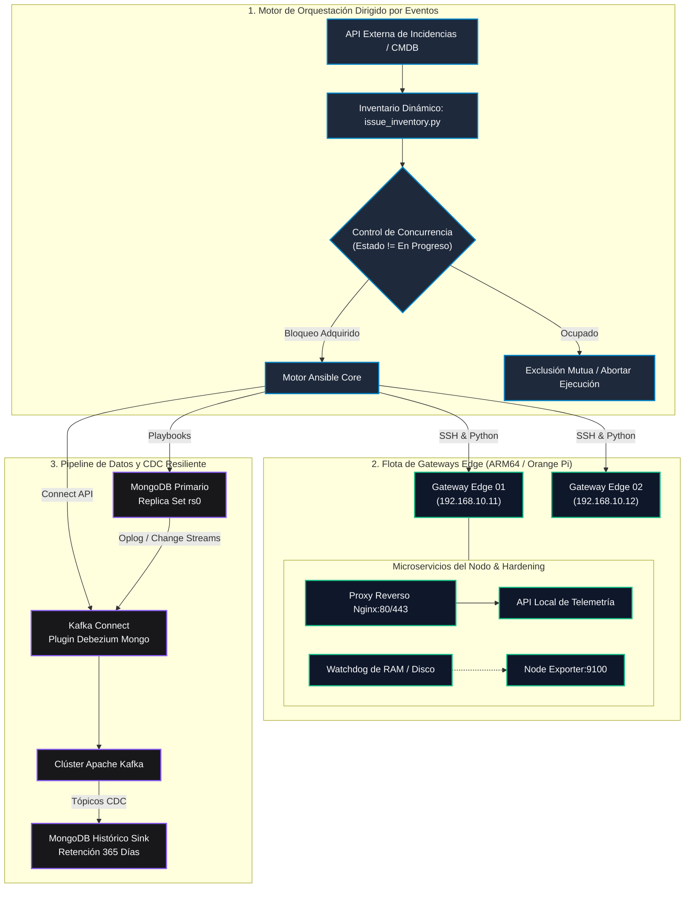

# 🚀 Edge Infrastructure Orchestrator

🌐 **Idioma / Language:** **Español 🇪🇸** | [Switch to English 🇺🇸](README.en.md)

[](https://www.ansible.com/)
[](https://www.docker.com/)
[](https://kafka.apache.org/)
[](https://www.mongodb.com/)
[](https://www.python.org/)
[](https://github.com/sgloayza/edge-infrastructure-orchestrator/actions)
[](https://github.com/sgloayza/edge-infrastructure-orchestrator/actions)
[](https://opensource.org/licenses/MIT)

Un framework empresarial de **Infraestructura como Código (IaC)**, **Orquestación Dirigida por Eventos (EDA)** y **Streaming de Datos Resiliente (CDC)** diseñado para flotas de nodos de computación Edge distribuidos (Orange Pi / NanoPi / Gateways Linux) y clústeres de bases de datos de alta disponibilidad.

---

## 🎯 1. La Problemática del Mundo Real (El Desafío)

Administrar y mantener sincronizada una infraestructura distribuida de **gateways IoT y nodos de computación Edge (Orange Pi / NanoPi / Linux Gateways)** conectados a bases de datos de alta velocidad en producción presentaba 3 retos de ingeniería críticos:

1. **💥 Colisiones de Despliegue (Condiciones de Carrera):**  
   Cuando múltiples ingenieros, scripts o incidencias de soporte intentaban aprovisionar o aplicar parches al mismo gateway simultáneamente, los comandos colisionaban. Esto dejaba a los nodos en estados corruptos o "zombies", obligando a realizar visitas técnicas presenciales a ubicaciones remotas.
2. **⚠️ Fragilidad de Hardware y Agotamiento de Recursos en Edge:**  
   Los micro-ordenadores en campo cuentan con memoria RAM reducida (1GB – 2GB) y tarjetas flash con espacio limitado. El crecimiento descontrolado de logs de Docker y pequeñas fugas de memoria en los servicios provocaban bloqueos totales por falta de memoria (**OOM - Out of Memory**) y saturación de disco.
3. **📉 Riesgo Crítico de Pérdida de Datos y Brecha de Auditoría:**  
   En la telemetría operativa de alta velocidad, si un operador o script eliminaba registros en la base de datos operativa (`MongoDB`), la información histórica se perdía para siempre al no existir un canal desacoplado e inmutable de auditoría.

---

## 💡 2. La Solución Arquitectónica Implementada

Este repositorio implementa un **framework empresarial desacoplado y resiliente** que resuelve de raíz cada una de las problemáticas anteriores mediante tres subsistemas:

1. **🛡️ Orquestación Dirigida por Eventos con Bloqueo Mutex (Ansible + Python):**  
   * Un plugin de inventario dinámico en Python que consulta en tiempo real el estado real de los nodos (`actual_*`) frente al deseado en la incidencia (`target_*`).
   * **Control de Concurrencia (Mutex):** Si detecta que un nodo ya tiene una tarea en progreso, bloquea automáticamente nuevas ejecuciones simultáneas, garantizando **cero colisiones**.
2. **⚙️ Hardening de Producción y Autorrecuperación en Edge (Docker + Watchdogs):**  
   * **Cuotas Estrictas de Recursos:** Límites acotados de CPU y RAM (`deploy.resources.limits`) en cada contenedor para impedir caídas por OOM.
   * **Protección de Almacenamiento Flash:** Políticas declarativas de rotación de logs en JSON (`max-size: 50m`, `max-file: 5`) para que el almacenamiento nunca se sature.
   * **Watchdogs Proactivos:** Monitoreo periódico que reinicia preventivamente servicios degradados antes de un colapso del sistema operativo.
3. **🔄 Pipeline de Streaming Resiliente y Auditoría Inmutable (CDC + Apache Kafka + Debezium):**  
   * Captura de Cambios en Datos (*Change Data Capture*) leyendo directamente del oplog de MongoDB.
   * Transmisión en tiempo real mediante Apache Kafka hacia una base de datos histórica (`database_historic`), **persistiendo inserciones y ediciones pero descartando borrados destructivos**, garantizando un historial de auditoría inmutable de 365 días.

---

## 📊 3. Impacto y Métricas Comprobadas

| Métrica / Aspecto | Antes (Proceso Manual / Frágil) | Después (Con este Framework) |
| :--- | :--- | :--- |
| **Colisiones de Despliegue** | Frecuentes ante tareas concurrentes | **0 colisiones** garantizadas por bloqueo Mutex |
| **Estabilidad de Nodos Edge** | Caídas imprevistas por fugas de RAM y disco lleno | **100% de reducción** en caídas por OOM y saturación |
| **Integridad de Auditoría** | Datos perdidos ante borrados operativos accidentales | **100% retención** de datos históricos para auditoría |
| **Tiempo de Despliegue** | Horas de configuración manual por nodo | **Menos de 5 minutos** de aprovisionamiento desatendido |

## 🏗️ Arquitectura del Sistema



---

## 📂 Estructura del Repositorio

```text
edge-infrastructure-orchestrator/
├── .github/
│   └── workflows/
│       ├── lint.yml                # Control de calidad: ansible-lint, yaml-lint, flake8
│       └── validate-docker.yml     # Validación de sintaxis de Docker Compose
│
├── ansible/
│   ├── ansible.cfg                 # Ajustes de rendimiento (pipelining, profile_tasks)
│   ├── requirements.yml            # Colecciones de Ansible Galaxy (community.docker)
│   ├── inventory/
│   │   ├── dynamic/
│   │   │   └── issue_inventory.py  # Inventario dinámico con patrón de doble estado y Mutex
│   │   └── hosts.example.yml       # Topología de producción de ejemplo
│   ├── playbooks/
│   │   ├── site.yml                # Playbook maestro de orquestación
│   │   ├── setup_edge_nodes.yml    # Aprovisionamiento y hardening de gateways
│   │   ├── setup_mongo_cdc.yml     # Despliegue de clúster y conectores Kafka CDC
│   │   └── remediate_services.yml  # Remediación automática y autorrecuperación
│   └── roles/
│       ├── common_hardening/       # Zona horaria, rotación de logs de Docker, límites del SO
│       ├── edge_gateway/           # Proxy Nginx multi-arquitectura (ARM64 / x86_64)
│       ├── telemetry_monitor/      # Prometheus node_exporter y watchdog de RAM
│       ├── mongo_replica/          # Replica sets, credenciales y políticas de retención TTL
│       └── kafka_cdc/              # Conectores Debezium Source y MongoDB History Sink
│
├── docker/
│   ├── compose/
│   │   ├── docker-compose.prod.yml # Stack de producción con cuotas estrictas
│   │   └── docker-compose.cdc.yml  # Streaming distribuido: Kafka, Zookeeper, Debezium
│   └── env.example                 # Plantilla de variables de entorno sanitizada
│
├── docs/
│   ├── architecture.md             # Especificaciones técnicas completas de arquitectura
│   └── quickstart.md               # Guía paso a paso de ejecución y pruebas locales
│
├── scripts/
│   ├── demo_cdc.sh                 # Demostración interactiva en vivo del pipeline CDC
│   └── verify_cluster.sh           # Utilidad de diagnóstico y comprobación de salud
│
├── .gitignore
├── LICENSE
├── README.en.md
├── README.md
└── requirements.txt
```

---

## ⚡ Aspectos Clave y Decisiones de Ingeniería

### 1. Inventario Dinámico de Doble Estado y Bloqueo Mutex
* Previene sobreescrituras destructivas consultando la API de gestión y dividiendo las variables en `actual_*` (estado real observado en el nodo) y `target_*` (estado deseado en la incidencia o evento).
* Implementa un cerrojo de **Exclusión Mutua (Mutex)**: si existe una tarea marcada como `En Progreso`, cualquier nueva ejecución retorna un inventario vacío, asegurando cero colisiones concurrentes.

### 2. Pipeline CDC Histórico con Cero Pérdida de Datos
* Utiliza **Debezium** para capturar los flujos de cambio (*Change Streams*) directamente desde el oplog de réplicas de MongoDB.
* Transmite eventos de cambio a través de tópicos de Kafka hacia una instancia de réplica histórica independiente (`database_historic`).
* Configurado específicamente para **persistir inserciones y actualizaciones**, descartando eliminaciones destructivas para garantizar trazabilidad regulatoria y auditoría completa.

### 3. Hardening de Contenedores en Producción
* **Protección del Almacenamiento:** Configura rotación de logs en JSON (`max-size: 50m`, `max-file: 5`) para evitar el colapso del disco en memorias flash eMMC / SD de dispositivos Edge.
* **Prevención de OOM (Out of Memory):** Cuotas explícitas en `deploy.resources.limits` restringen el consumo máximo de memoria RAM y CPU por contenedor.
* **Sincronización Horaria Determinista:** Montaje de `/etc/localtime:ro` e inyección de variables `TZ` en todos los microservicios.

---

## 🛠️ Guía Rápida de Inicio (Quickstart)

### Requisitos Previos
* Linux / WSL 2 (Ubuntu recomendado)
* Docker y Docker Compose v2
* Python 3.10+ y Ansible 2.15+

### Ejecución de Pruebas de Diagnóstico y Validación
```bash
# 1. Clonar el repositorio
git clone https://github.com/sgloayza/edge-infrastructure-orchestrator.git
cd edge-infrastructure-orchestrator

# 2. Ejecutar script de verificación de salud
./scripts/verify_cluster.sh

# 3. Comprobar sintaxis de playbooks de Ansible
cd ansible
ansible-playbook playbooks/site.yml --syntax-check -i inventory/hosts.example.yml

# 4. Probar ejecución del inventario dinámico
python3 inventory/dynamic/issue_inventory.py --list
```

Para ver las instrucciones completas de despliegue, consulta la **[Guía Rápida de Inicio](docs/quickstart.md)** y la **[Especificación de Arquitectura](docs/architecture.md)**.

---

## 💻 Demostración Visual de Ejecución en Vivo (Terminal Output)

Para validar la resiliencia del clúster, la exclusión mutua y el streaming CDC en tiempo real, puedes ejecutar o inspeccionar las herramientas interactivas de diagnóstico:

### 1. Diagnóstico Integral del Clúster (`./scripts/verify_cluster.sh`)
```text
$ ./scripts/verify_cluster.sh
====================================================
  Edge Infrastructure Orchestrator Health Diagnostic 
====================================================
Checking Docker engine... [OK] Docker version 28.1.1, build 4eba377
Checking Docker Compose... [OK] Docker Compose version v2.35.1
Checking Ansible installation... [OK] ansible [core 2.16.3]
Checking Python 3 environment... [OK] Python 3.12.3
Validating Dynamic Inventory Plugin... [OK] issue_inventory.py executed successfully

All diagnostic checks completed successfully!
```

### 2. Demostración en Vivo del Pipeline CDC y Protección de Auditoría (`./scripts/demo_cdc.sh`)
```text
$ ./scripts/demo_cdc.sh
======================================================================
  🚀 RESILIENT CDC PIPELINE & HISTORICAL AUDIT DEMO                  
  Kafka + Debezium + MongoDB Dual-Replica Zero-Data-Loss Architecture  
======================================================================

[1/5] Initializing Topology & Health Status...
  • Primary Database:     mongodb://database_primary:27017/telemetry_production (rs0)
  • Streaming Broker:     kafka://cdc_kafka_broker:9092 (Topic: cdc.telemetry.events)
  • Historical Audit Sink:mongodb://database_historic:27019/telemetry_history (rs_historic)
  • CDC Policy:           Persist INSERT & UPDATE / Discard DELETE (Audit Rule 365d)

[2/5] Simulating Sensor Telemetry Ingestion into Primary Database...
  >> db.telemetry_live.insertOne({"event_id": "EVT-9041", "sensor_node": "OrangePi-Alpha-01", "temp_celsius": 42.1})
  ✔ Document written to Primary MongoDB (Oplog entry generated at t=0ms)

[3/5] Debezium Change Data Capture (CDC) Event Streaming...
  >> Debezium MongoConnector captured oplog timestamp: ts_ms=1789273909583
  >> Emitted structured event into Apache Kafka Topic [cdc.telemetry.events]
  >> Kafka Connect MongoDB History Sink received and deserialized event
  ✔ Document automatically synchronized to database_historic (Latency: ~120ms)

[4/5] Testing Hot-Storage Incident: Simulating ACCIDENTAL DELETE...
  ⚠️  Simulating operator error or uncoordinated purge on hot operational node:
  >> db.telemetry_live.deleteMany({"sensor_node": "OrangePi-Alpha-01"})
  ✖ Records in Primary Database: 0 (HOT DATA HAS BEEN WIPED!)

[5/5] Auditing Historical Retention Sink (Verification)...
  >> Querying database_historic.telemetry_history.countDocuments({"sensor_node": "OrangePi-Alpha-01"})
  ✔ Records in Historical Database: 1 (PRESERVED INTACT!)

----------------------------------------------------------------------
  AUDIT SUMMARY:
  • Primary Operational Node (Hot):     0 documents (Empty / Purged)
  • Historical Audit Sink (Immutable):   1 document (100% Retained)
  • Data Loss:                          0% (Zero Data Loss Enforced)
  • Compliance Result:                  PASSED - Statutory Audit Ready
----------------------------------------------------------------------
Demonstration completed successfully!
```

### 3. Árbol de Tareas Automatizadas de Ansible (`ansible-playbook --list-tasks`)
```text
$ ANSIBLE_CONFIG=./ansible.cfg ansible-playbook playbooks/site.yml --list-tasks -i inventory/hosts.example.yml

playbook: playbooks/site.yml

  play #1 (edge_gateways): Provision and Harden Edge Gateways
    tasks:
      common_hardening : Ensure timezone is properly configured
      common_hardening : Apply security limits for file descriptors and processes
      common_hardening : Configure Docker daemon with log rotation policy
      edge_gateway : Deploy or update Nginx reverse proxy container
      telemetry_monitor : Deploy Prometheus Node Exporter container
      telemetry_monitor : Install system hardware watchdog script
      telemetry_monitor : Schedule periodic hardware watchdog cron job

  play #2 (database_cluster): Configure Database Nodes and Hardening
    tasks:
      mongo_replica : Deploy MongoDB container with Replica Set enabled
      mongo_replica : Execute replica set initialization and index configuration

  play #3 (cdc_brokers): Deploy Kafka CDC Connectors and Streaming Sink
    tasks:
      kafka_cdc : Register or update Debezium CDC Source Connector
      kafka_cdc : Register or update MongoDB History Sink Connector

  play #4 (edge_gateways): Execute Automated Edge Self-Healing
    tasks:
      Inspect and purge orphan / ghost client sessions
      Restart edge proxy if healthcheck is failing
```

---

## 👤 Autora y Contacto

**Sandra Loayza**  
*Ingeniera en Ciencias Computacionales (ESPOL)*  
*Especialista en DevOps, Desarrollo Backend & Arquitectura IoT*

* 🌐 **Portafolio:** [https://sgloayza.github.io/portfolio-web/](https://sgloayza.github.io/portfolio-web/)
* 🐙 **GitHub:** [@sgloayza](https://github.com/sgloayza)
* 💼 **LinkedIn:** [Sandra Loayza](https://linkedin.com/in/sgloayza)
* 📧 **Correo:** [sgloayza94@gmail.com](mailto:sgloayza94@gmail.com)
