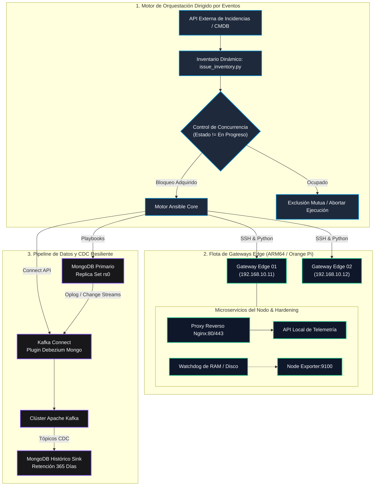

# 🏗️ Arquitectura del Sistema y Especificaciones Técnicas

🌐 **Idioma / Language:** **Español 🇪🇸** | [Switch to English 🇺🇸](architecture.en.md)

El **Edge Infrastructure Orchestrator** es un framework empresarial diseñado para administrar, blindar y automatizar flotas de dispositivos de cómputo Edge distribuidos (ej. microordenadores Orange Pi / ARM64) junto con un pipeline de streaming y auditoría de datos resiliente.

---

## 1. Topología Arquitectónica de Alto Nivel

---

## 2. Pilares Arquitectónicos Fundamentales

### A. Patrón de Inventario Dinámico con Doble Estado
Para evitar sobreescrituras destructivas en dispositivos remotos, el plugin de inventario consulta la plataforma de gestión e inyecta dos conjuntos de atributos:
* **Variables `actual_*`**: Capturan el estado en ejecución del nodo (zona física actual, versión de firmware activa, configuración IP).
* **Variables `target_*`**: Inyectadas desde el ticket de cambio o evento disparador.
* **Salvaguarda de Idempotencia**: Los roles de Ansible comparan `actual_*` contra `target_*` antes de realizar transiciones de estado, garantizando que las configuraciones que no requieren cambios no sean alteradas.

### B. Control de Concurrencia con Bloqueo Mutex (Exclusión Mutua)
Al ejecutar tareas automatizadas o despliegues en nodos Edge, las ejecuciones simultáneas corren el riesgo de corromper recursos de hardware compartidos o saturar enlaces de red:
1. Al arrancar Ansible, el hook de orquestación verifica si otra tarea figura marcada como `In-Progress`.
2. Si existe otra tarea ejecutándose en el clúster, el resolvedor de inventario retorna un conjunto vacío (`results = []`), abortando la ejecución de forma segura y garantizando **cero colisiones**.

### C. Pipeline de Streaming CDC con Cero Pérdida de Datos (Zero Data Loss)
* **Origen:** Instancia primaria de MongoDB en el Edge o en el servidor central capturando telemetría de sensores IoT en tiempo real.
* **Motor de Captura:** Conector Debezium MongoDB Source rastreando cambios directamente desde el registro transaccional (`oplog.rs`).
* **Nodo Histórico de Auditoría:** El conector sink transforma los eventos de Kafka en registros inmutables. Los borrados destructivos en la base primaria no se replican como borrados en la base histórica, garantizando trazabilidad y cumplimiento de auditorías legales por 365 días.

### D. Hardening de Contenedores en Producción
Todas las cargas de trabajo en Docker aplican cuotas estrictas de recursos y seguridad:
* **Rotación de Logs:** Driver JSON configurado con `max-size: 50m` y `max-file: 5`, impidiendo totalmente la saturación de tarjetas SD o almacenamiento eMMC flash.
* **Cuotas de Recursos:** `deploy.resources.limits` restringe el consumo máximo de memoria RAM y CPU, evitando que el OOM-Killer del kernel congele el sistema operativo.
* **Mapeo de Zona Horaria:** Montaje de solo lectura de `/etc/localtime:ro` junto con variables de entorno `TZ`, asegurando logs sincronizados en gateways geográficamente dispersos.
