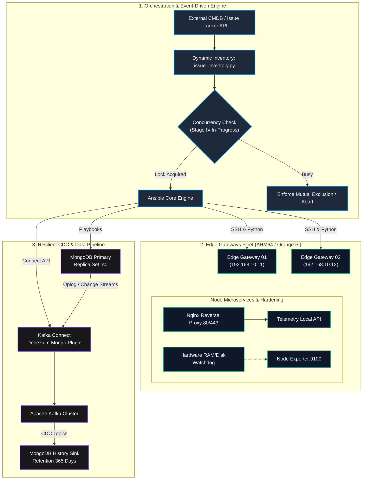

# System Architecture & Technical Specifications

The **Edge Infrastructure Orchestrator** is an enterprise-grade framework designed to manage, harden, and automate fleets of distributed Edge computing devices (e.g., Orange Pi / ARM64 single-board computers) alongside resilient distributed data pipelines.

---

## 1. High-Level Architecture Topology

---

## 2. Core Architectural Pillars

### A. Dual-State Dynamic Inventory Pattern
To prevent destructive updates on remote edge devices, the inventory plugin queries the management platform and injects two distinct sets of attributes:
* **`actual_*` Variables**: Captures the running state of the host (current zone, active firmware version, IP configuration).
* **`target_*` Variables**: Injected from the change ticket / event trigger.
* **Idempotency Guard**: Ansible roles compare `actual_*` against `target_*` before performing state transitions, ensuring that undisturbed configuration keys remain untouched.

### B. Mutual Exclusion (Mutex) Concurrency Lock
When executing automated remediations or rollouts on edge nodes, concurrent runs risk corrupting shared hardware resources or network links:
1. When Ansible starts, the orchestration hook verifies if another task is marked `In-Progress`.
2. If another task is running on the cluster, the inventory resolver returns an empty set (`results = []`), terminating the play safely without collisions.

### C. Zero Data Loss Change Data Capture (CDC) Pipeline
* **Source:** Primary MongoDB instance on Edge or aggregation server capturing real-time telemetry from IoT field sensors.
* **Capture Engine:** Debezium MongoDB Source Connector tracking changes directly from MongoDB's replica set Change Streams.
* **Audit Sink:** The sink connector transforms Kafka events into immutable historical records. Hard deletions in the primary store do not delete records in the historical sink, guaranteeing full regulatory traceability.

### D. Production Container Hardening
All Docker workloads follow strict security and resource quotas:
* **Log Rotation:** JSON log driver configured with `max-size: 50m` and `max-file: 5`, completely preventing storage depletion on flash SD cards / eMMC storage.
* **Resource Quotas:** `deploy.resources.limits` bounds memory (RAM) and CPU consumption, preventing OOM-Killer kernel panics.
* **Timezone Mapping:** Local timezone mounted read-only (`/etc/localtime:ro`) alongside `TZ` environment variables to ensure synchronized system logs across geographically dispersed gateways.
